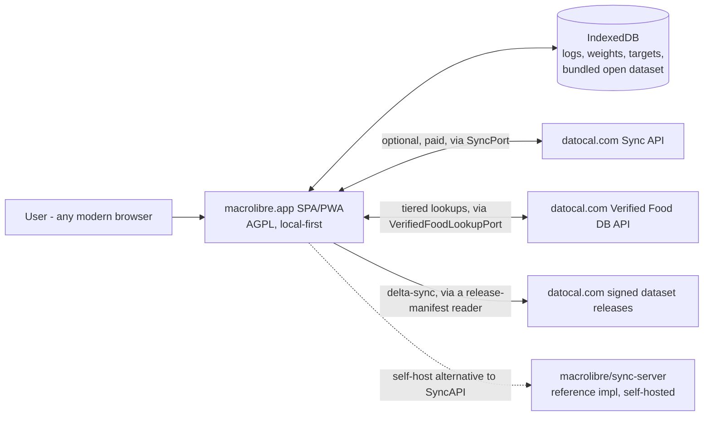
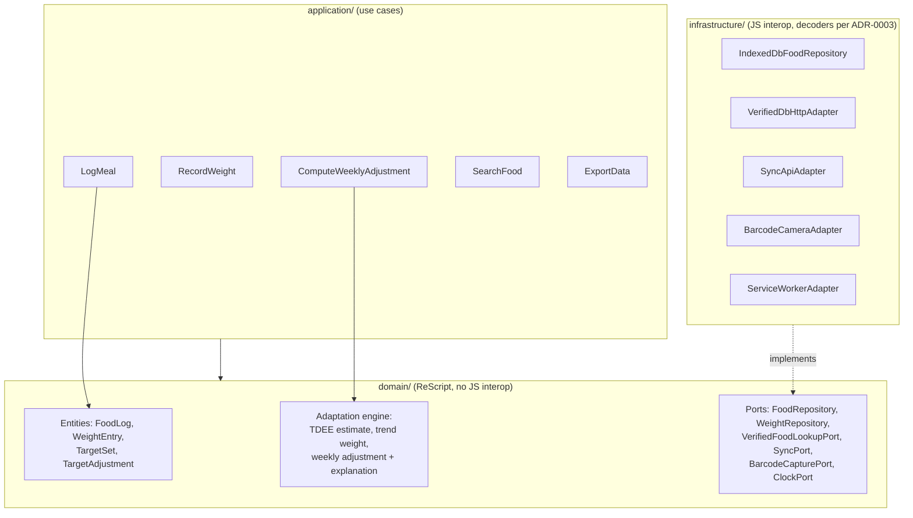
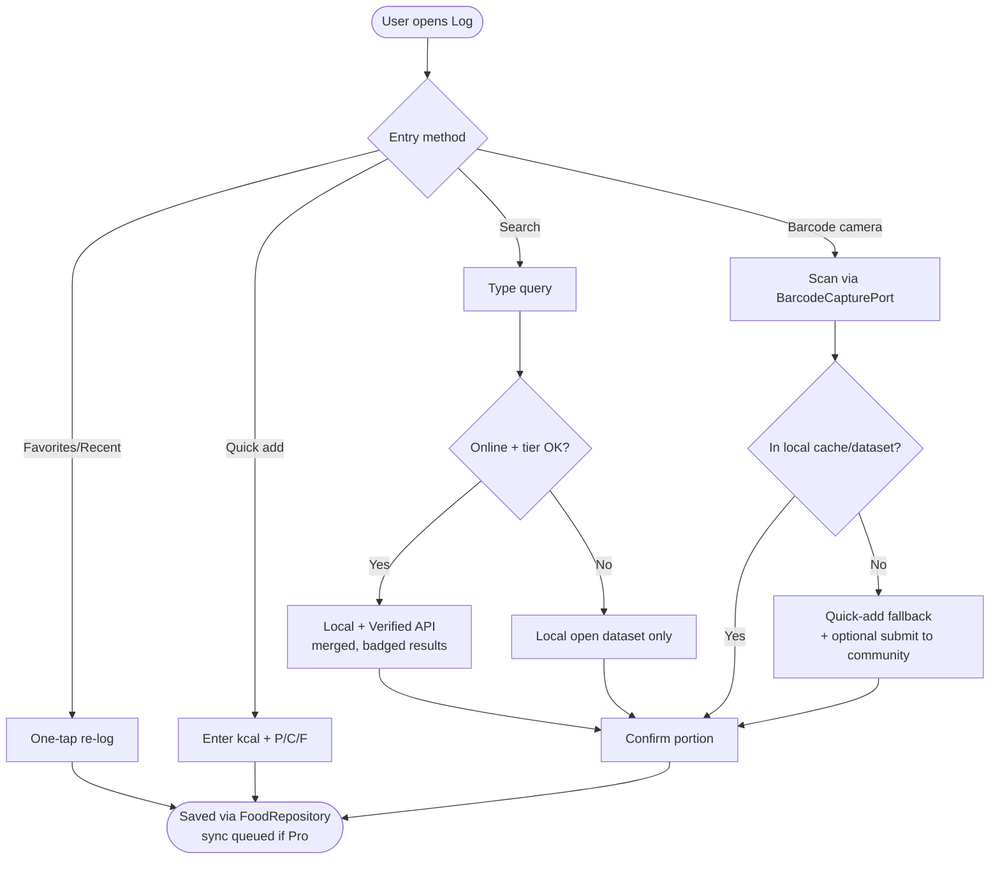
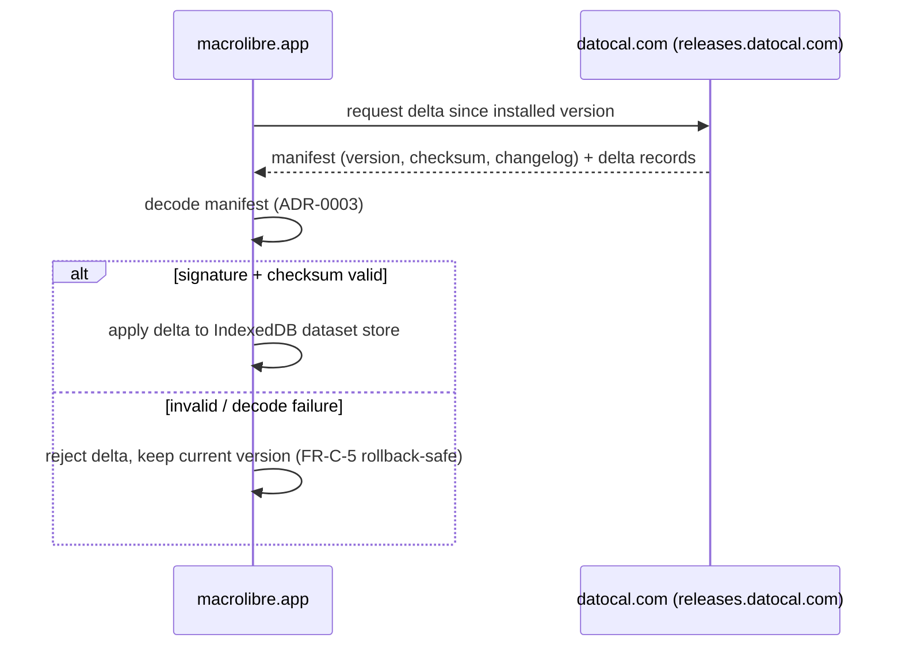

# Architecture — macrolibre.app (client)

Scope: this document covers the **client** only. The hosted platform
(Verified Food DB, dietitian pipeline, billing, dataset signing) lives in the
separate, proprietary `datocal.com` repository. See `../srs-macrotracker-mvp.md`
in the workspace root for the full product SRS both repos derive from.

Status: [ADR-0001](adr/0001-frontend-framework-selection.md) (frontend
language) is **Accepted**. [ADR-0002](adr/0002-adopt-hexagonal-architecture-for-the-spa-client.md)
(hexagonal layering) and [ADR-0003](adr/0003-runtime-safety-strategy-boundary-decoding.md)
(boundary decoding) remain **Proposed** — the diagrams below reflect all
three, but only the language choice is settled.

## 1. System context

The client never talks to a database directly. `SyncApiAdapter` and
`VerifiedDbHttpAdapter` are the only code aware that `datocal.com` exists on the
other end — a self-hoster can substitute `macrolibre/sync-server` behind the
same `SyncPort` without any domain/application change.

## 2. Hexagonal layering

Domain and application code depend only on port interfaces, never on a
concrete adapter — enforced by [ADR-0002](adr/0002-adopt-hexagonal-architecture-for-the-spa-client.md).
Every arrow crossing into `infrastructure/` is a JS-interop boundary that must
decode through [ADR-0003](adr/0003-runtime-safety-strategy-boundary-decoding.md)'s
decoders before becoming a domain type.

## 3. Logging flow (FR-A)

Median ≤ 5 s, p95 ≤ 15 s end-to-end (NFR-2) — every step in this flow runs
against local IndexedDB first; the Verified API is additive, never blocking.

## 4. Dataset delta-sync (client side of FR-C)

## Open items

- The SRS (`srs-macrotracker-mvp.md` §2.5) names a third codebase,
  `macrolibre/sync-server` (public AGPL reference sync implementation), as a
  separate repo from both `macrolibre.app` and `datocal.com`. Only two local
  folders exist today (`macrolibre.app`, `datocal.com`) — decide whether/when to
  set up `sync-server` as its own repo.
- Hexagonal layering ([ADR-0002](adr/0002-adopt-hexagonal-architecture-for-the-spa-client.md))
  and boundary decoding ([ADR-0003](adr/0003-runtime-safety-strategy-boundary-decoding.md))
  are still **Proposed**. Nothing describing those layers here should be
  treated as final until they're Accepted; the frontend language
  ([ADR-0001](adr/0001-frontend-framework-selection.md)) is settled.
